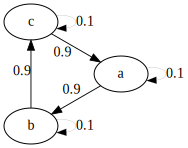
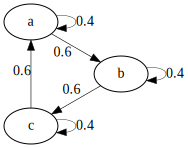
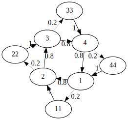
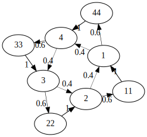
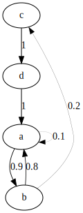
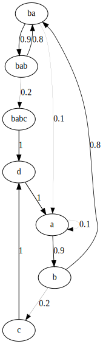

# Generator Modifiers

## `blur` - Blur Probabilities

Distributes the weights more evenly, so that the generated sequence becomes less predictable.

### Syntax

`(blur <blur factor>)`

### Parameters 
* `blur factor` - amount of blurriness, where 0.0 has no effect and 1.0 blurs a lot.

### Example

```lisp
;; infer a loop with occasional repetitions
(sx 'con #t 
  (infer 'duct :events 
    'a (saw 'a2)
    'b (saw 'f2)
    'c (saw 'c3)
    :rules 
      (rule 'a 'a 10 200) 
      (rule 'a 'b 90 200) 
      (rule 'b 'b 10 400) 
      (rule 'b 'c 90 400) 
      (rule 'c 'c 10 100) 
      (rule 'c 'a 90 100)))
```

 

```lisp
;; now blur
(sx 'con #t 
  (blur 0.8 
    (infer 'duct :events 
      'a (saw 'a2)
      'b (saw 'f2)
      'c (saw 'c3)
      :rules 
          (rule 'a 'a 10 200) 
          (rule 'a 'b 90 200) 
          (rule 'b 'b 10 400) 
          (rule 'b 'c 90 400) 
          (rule 'c 'c 10 100) 
          (rule 'c 'a 90 100))))
```

 

```lisp
;; you can use blur over time, too
(sx 'con #t 
  (every :n 10 (blur 0.1) ;; blur every 10 steps
    (infer 'duct :events 
      'a (saw 'a2)
      'b (saw 'f2)
      'c (saw 'c3)
      :rules 
          (rule 'a 'a 10 200) 
          (rule 'a 'b 90 200) 
          (rule 'b 'b 10 400) 
          (rule 'b 'c 90 400) 
          (rule 'c 'c 10 100) 
          (rule 'c 'a 90 100))))
```

---

## `cmp` - Compose Generators

### Syntax
```lisp
(cmp <generators>)
```

### Examples

```lisp
;; The plain lisp approach would be:
(sx 'composed #t
    (pear (rev 0.1)
		(every :n 20 (haste 2 0.5)
			(cyc 'bl "bd ~ ~ sn ~ ~"))) )

;; this makes it somewhat inconvenient to add/disable certain parts.

;; With cmp, it can be re-written as:
(sx 'composed #t
    (cmp
		(pear (rev 0.1))
		(every :n 20 (haste 2 0.5))
		(cyc 'bl "bd ~ ~ sn ~ ~")
		))

;; now individual modifiers can easily be commented out

```

---

## `grow` - Enlarge Generator

The growth algorithm allows adding information to an already existing generator.
It does so by picking an event the generator yielded in the past, shaking up the values
a little, and adding it to the generator following certain principles.

### Parameters

* `:var` (float) - variation factor (smaller -> less variation)
* `:method` (symbol) - growth method/mode (see below)
* `:durs` (list of ints) - durations to mix in
* `:rnd` (int) - chance to add random edges after growth

### Examples

```lisp
(sx 'al #t
	(every :n 10 (grow) 
		(nuc 'gae (sqr 120))))
```

### Modes

Each growth mode pushes the generator in a certain direction.

* `'default`
* `'triloop`
* `'quadloop`
* `'flower`
* `'loop` 

---

## `haste` - Speed Up Evaluation

Speed up evaluation for a specified number of steps, by a certain ratio.

### Examples

```lisp
(sx 'more #t
    (xspread     
     (cmp ;; this is another copy with modifiers ...
          (pear (freq-mul 3.0))
          (every :n 20 (haste 4 0.5))) ;; <- every 20 steps, double-time for four steps. Change to 0.25 for quadruple-time, etc
     ;; this is the "original" 
     (cyc 'one "tri:120 tri:90 tri:100 tri:120 ~ ~ ~ ~")))
```

---

## `life` - Manipulate Generator

This is one of the more complex generator manipulations. To understand it, it's helpful to play around 
with the `(grow ...)` function first. What the `(life ...)` method does is basically the same, but automated
and bound to resources, in the fashion of a primitive life-modeling algorithm:

* There's a global pool of resources (which is just an abstract number).
* Each generator is assigned an amount of local resources (same as above).
* Each time the generator grows, it comes at a cost, which is subtracted first from the local, then from the global resources.
* If all resources are used up, nothing can grow any further.

Each symbol in the current alphabet is assigned an age (the number of times it has been evaluated), so at a certain, specified
age they can perish, freeing a certain amount of resources (which are added to the local resource pool).

Furthermore, if specified, the generator can be configured to "eat itself up" when a shortage of resources occurs. That means 
that an element will be removed before its time, freeing resources for further growth (which, again, are added to the local resources).

### Parameters

* growth cycle (int)
* average lifespan (int)
* variation (float)
* `:method` - growth method (see `(grow ...)`)
* `:durs` - list of possible durations to choose from
* `:apoptosis` (bool) - if `nil`, symbols never die
* `:autophagia` (bool) - if `t`, the generator will eat its own symbols to generate energy for further growth

```
;; define global resources
(global-resources 30000)
```

### Examples

The algorithm is quite configurable, but to use the default configuration, you can simply use:

```lisp
(sx 'the-circle #t
    (life 10 12 0.4 ;; first arg: growth cycle, second arg: average lifespan, third arg: variation factor
          (cyc 'of-life "tri:100 tri:120 ~ ~ tri:120 tri:180 ~ tri:200")))
```

This means that every ten steps the generator will grow, while the average lifespan of an element is 12 evaluations.
The a variantion factor of 0.4 will be applied when generating the new elements.

You can specify a growth method (see the paragraph on `(grow ...)` for details):

```lisp
(sx 'the-circle #t
    (life 10 12 0.4 :method 'flower
          (cyc 'of-life "tri:100 tri:120 ~ ~ tri:120 tri:180 ~ tri:200")))
```

To add some rhythmical variation, you can mix in other durations (chosen at random):

```lisp
(sx 'the-circle #t
    (life 10 12 0.4 :method 'flower :durs 100 200 200 200 400 100
          (cyc 'of-life "tri:100 tri:120 ~ ~ tri:120 tri:180 ~ tri:200")))
```

Another interesting way to use this is to juxtapose it with a static generator (note the reset flag is nil'd so
we can change parameters without starting from scratch every time):

```lisp
(sx 'the-circle #t
    (xspread
		(pear (freq-mul 1.5) (life 10 12 0.4 :method 'flower :durs 100 200 200 200 200 400))
		(cyc 'of-life "tri:100 tri:120 ~ ~ tri:120 tri:180 ~ tri:200")))
```

---

## `relax` - Slow Down Generator

Slows down generator for a specified number of steps, by a certain ratio.

### Examples

```lisp
(sx 'more #t
    (xspread     
     (cmp ;; this is another copy with modifiers ...
          (pear (freq-mul 3.0))
          (every :n 20 (relax 4 0.5))) ;; <- every 20 steps, half-time for four steps
     ;; this is the "original" 
     (cyc 'one "tri:120 tri:90 tri:100 tri:80 ~ ~ tri:120 tri:90 tri:100 tri:80 ~")))
```

---

## `reverse` - Reverse Generator

This function reverses every edge in the PFA. If you're a TidalCycles user, keep in mind that this works quite differently from TidalCycle's `rev`!
The generators will still have the same starting point, they will just move in the opposite direction. Especially if you use it with `cyc`, the
visual impression might be misleading.

### Example 

```lisp
;; let cycles run in opposite direcions, from the same starting point ...
(sx 'ba #t 
  (xspread
    (reverse)
    (cyc 'da "saw:100 ~ saw:200 saw:400")))
    
;; If you want to change the starting point (with the reversed generator starting on the last note),
;; you can skip forward:
(sx 'ba #t 
  (xspread
    (reverse (skip 3))
    (cyc 'da "saw:100 ~ saw:200 saw:400")))
```

```lisp
;; regular
(cyc 'da :rep 20 :max-rep 2 "saw:100 saw:200 saw:300 saw:400")
```




```lisp
;; reversed
(reverse (cyc 'da :rep 20 :max-rep 2 "saw:100 saw:200 saw:300 saw:400"))
```



---

## `rewind` - Rewind Generator

Re-winds the generator by a specified number of steps. The further unfolding might
be different from the previous one, obviously.

### Examples

```lisp
(sx 'more #t
    (xspread     
     (cmp ;; this is another copy with modifiers ...
          (pear (freq-mul 3.0))
          (every :n 20 (rewind 2))) ;; <- every 20 steps, rewind 2 steps (only the copy)
     ;; this is the "original" 
	 (cyc 'one "tri:120 tri:90 tri:100 tri:80 ~ ~ tri:120 tri:90 tri:100 tri:80 ~")))
```

---

## `shrink` - Shrink Generator
Removes a symbol from the generator's alphabet. While `grow` adds symbols based on 
the existing ones, this will remove them.

### Example
```lisp
;; this will grow faster than it shrinks
(sx 'ba #t
    (every :n 10 (grow 0.2) :n 20 (shrink) 
        (nuc 'ba (saw 120))))
```

---

## `skip` - Skip Events
Skips ahead a specified number of steps.

### Example

```lisp
(sx 'more #t
    (xspread     
     (cmp ;; this is another copy with modifiers ...
          (pear (freq-mul 3.0))
          (every :n 20 (skip 2))) ;; <- every 20 steps, skip 2 steps ahead (only the copy)
     ;; this is the "original" 
	 (cyc 'one "tri:120 tri:90 tri:100 tri:80 ~ ~ tri:120 tri:90 tri:100 tri:80 ~")))
```

## `solidify` - Solidify Generator
Looks at a generator's history of emitted symbols and adds a higher-order connection to make
the last sequence more likely to happen again.

### Example

```lisp
(defpart 'ga
  (every 
    :n 8 (solidify 4) ;; <- four last symbol emissions
    (infer 'ta :events 'a (sqr 550) 'b (sqr 200) 'c (sqr 300) 'd (sqr 400)
      :rules
      (rule 'a 'a 10 100)
      (rule 'a 'b 90 100)
      (rule 'b 'a 80 100)
      (rule 'b 'c 20 100)
      (rule 'c 'd 100 100)
      (rule 'd 'a 100 100) 
      )))

;; step 8 times
(step-part 'ga)
```
Initial generator:



After solidification:



