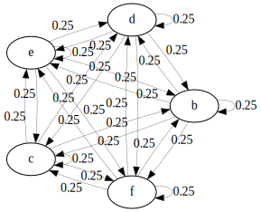

# Sequence Generators

## `cyc` - Cycle Generator

Generates a cycle (aka loop) from a simple sequencing language. You can specify parameters within the sequence language,
or placeholders. Also, you can specify deviations from the default duration between events within the sequencing language.
It might seem simple, but this is one of the most powerful generators in Mégra.

#### Parameters

* name - generator name
* sequence - sequence description
* `:dur` - default space between events 
* `:rep` - probability of repeating an event
* `:max-rep` - limits number of repetitions
* `:rnd` - random connection probability (currently not working the way I expected it ...)
* `:map` - map events on parameters
* `:events` - use labeled events

### Syntax

```lisp
(cyc <name> :dur <duration> :rep <repetition probability> :max-rep <max number of repetitions> :rnd <random connection prob> <sequence>)
```

### Example 
```lisp
;; plain
(sx 'simple ##t
  (cyc 'beat "bd ~ hats ~ sn ~ hats ~"))
```

 

```lisp
;; with a 40% chance of repetition, 2 times at max
(sx 'simple ##t
    (cyc 'beat :rep 40 :max-rep 2 "bd ~ hats ~ sn ~ hats ~"))
```


```lisp
;; with labeled events
(sx 'simple ##t	
	(cyc 'beat 
	:events 'a (bd) 'b (hats) 'c (sn)
	"'a ~ 'b ~ 'c ~ 'b ~"))
```

```lisp
;; with parameters and placeholder
(sx 'simple ##t	
	(cyc 'beat 
	:map 'saw 
	"200 ~ 120 140 'a3")) ;; you can use frequencies or note names 
```

```lisp
;; with escape durations
(sx 'simple ##t
	(cyc 'beat "bd ~ hats /100 hats /100 ~ sn ~ hats ~"))
```

```lisp
;; control cycles with other cycles
(sx 'control ##t
	(cyc 'ba 
		:dur 1599 ;; switch just in time ... will run out of sync eventually
		:events
		'a (ctrl (sx 'controlled ##t (cyc 'fa "bd sn")))
		'b (ctrl (sx 'controlled ##t (cyc 'fa "hats hats")))
		"'a 'b 'a 'b"
		))
```

---

## `chop` - Chop Sample

Chop a sample into parts, that will be played as a loop. All other parameters of 
a loop can be applied (`rep`, `max-rep` and `rnd`).

### Examples

```lisp
;; chop violin sample into 8 parts (each of which is 200ms long)
(sx 'some ##t
  (chop 'chops 8 (violin 'a3 :sus 200))) 
```

---


## `flower` - Flower Generator

Create ... well, look at the examples.

##### Syntax
`(flower <name> :pistil <event> :layers <layers> :petals <events>)`

### Parameters

* `name` - generator name
* `:layers` - number of layers
* `:pistil` - pistil or central event
* `:petals` - list of events (will be padded to appropriate lenght if necessary)

### Examples

```lisp
;; flower with one layer and four petals
(sx 'a-rose-is-a ##t
  (flower 'rose 
    :pistil (saw 100)
    :petals (saw 200) (saw 300) (saw 400) (saw 150)))
```


Flower with 2 layers:
```lisp
(sx 'a-rose-is-a ##t
  (flower 'rose 
    :layers 2
    :pistil (saw 100)
    :petals (saw 200) (saw 300) (saw 400) (saw 150) 
            (saw 400) (saw 600) (saw 800) (saw 300)))
```


---


## `friendship` - Windmill Generator

This creates a directed version of a Friendship- or Windmill graph.

### Syntax

`(friendship <name> :center <center event> :friends <list of events>)`

### Parameters

* `name` - the generator name
* `:center` - the center of the "social circle"
* `:friends` - the "friends".
* `:rep` - chance of repetition.
* `:max-rep` - maximum number of repetitions
* `:rnd` - generate random shortcuts
* `:events` - collect labeled events

### Example

```lisp
(sx 'friend ##t
  (cmp
    (pear (atk 1) (rel 90) (sus 10) (rev 0.07))
      (friendship 'ship 
        :dur 100
		:center  (saw 'a2) 
        :friends (saw 'c3) (saw 'e3) (saw 'b3) (saw 'd3) (saw 'f3) (saw 'c4))))
```


---

## `fully` - Random Generator

Each node follows each other node with equal probablity ... so basically a random generator.

### Syntax
```lisp
(fully <name> :rest <list of events> :events <labeled events>)
```

### Example

```lisp
;; random generator with five events
(sx 'full ##t
    (fully 'mel :rest (saw 'a3) (saw 'f2) (saw 'c3) (saw 'e3) (saw 'a4)))

```



---

## `infer` - Infer from Rules

Infer a generator from arbitrary rules. Make sure every event has
at least one exit, otherwise the generator will stop.

Also, exit probablities for each node should add up to 100.

### Parameters

* `name` - generator name
* `:events` - labeled event mapping
* `:rules` - transition rules - Format `(rule <source> <destination> <probability> <duration (optional)>)`

### Example

```lisp
;; infer 
(sx 'con #t 
  (infer 'duct :events 
    'a (saw 'a2)
    'b (saw 'f2)
    'c (saw 'c3)
    'd (saw 'e4)
    :rules 
    (rule 'a 'a 80 200) ;; repeat 'a with 80% chance
    (rule 'a 'b 20 200) ;; move to 'b with 20% chance
    (rule 'aaa 'c 100 200) ;; after 3 repetitions of 'a, always move to 'c
    (rule 'b 'b 100 400) ;; repeat 'b always
    (rule 'bb 'd 100 400) ;; ... well, 2x max
    (rule 'c 'c 100 100) ;; same for 'c
    (rule 'ccc 'a 100 400) 
    (rule 'd 'd 80 200) ;; 'd is repeated with 80% chance as well
    (rule 'd 'a 20 200) ;; and moves back to 'a with 20% chance
    (rule 'ddddd 'b 100 400))) ;; and is repeated 5x max

```


---

## `learn` - Learn a Generator

Learn a generator from a sample string. Based on the variable-order Markov chain learning algorithm
proposed in *Ron, Singer, Tishby - The Power of Amnesia (1996)*.

### Parameters
* `:events` - Event definitions.
* `:sample` - Sample string to learn from. Uses the defined event mapping as characters.
* `:bound` - The maximum order of the learned markov chain, that is, how far to look back when determining the next step.
* `:epsilon` - Probability threshold, a connection that's less likely than that won't be learned. The higher, the longer it takes to learn.
* `:size` - Maximum generator size (nodes in the probabilistic finite automaton generated).
* `:autosilence` - Use `~` as default character for silence.

### Example
Learn a trap-like beat from a sample string.
```lisp
(sx 'from #t
  (learn 'data
    :events 'x (bd) 'o (sn) 'h (hats)
    :sample "xoxoxoxox~~o~h~~~h~h~h~~h~h~~hhh~x~o
             ~x~o~x~o~x~o~xh~h~~hhh~x~o~x~o~x~o~x
             ox~xox~xox~xoxo~xoxo~xoxox~oooo~xxxx
             ~xoxoxox~ohxhohxhohxhxhxhxhxhxhxhoho
             hoh"))
```


---

## `lin` - Linear Sequence

If you just need a simple, linear sequence (no repetition), this is the way to go. This is 
great to write scores, using the linear sequence with control events to score other generators.

### Example

```lisp
;; default durations
(sx 'conductor #t
  (lin 'score 
    (ctrl (sx 'part #t (cyc 'ga "bd ~ sn ~"))) 4000
	(ctrl (sx 'part #t (cyc 'ga "bd hats sn hats"))) 4000
	(ctrl (sx 'part #t (cyc 'ga "[bd cym] cym [sn cym] cym"))) 4000
	(ctrl (clear))
	))

```

---

## `loop` - Loop Generator

The `cyc` generator is a complex beast, pretty much a tiny language on its own. The loop generator is a 
very simple generator if you want a plain loop in a lisp-y syntax.

### Example

```lisp
;; default durations
(sx 'around ##t
  (loop 'and-around (saw 100) (saw 200) (saw 300) (saw 400)))
  
;; custom durations
(sx 'around ##t
  (loop 'and-around (saw 100) 400 (saw 200) 100 (saw 300) 200 (saw 400)))
```

---

## `nuc` - Nucleus Generator

Generates a one-node repeating generator, i.e. as a starting point for growing.

### Parameters

* name (symbol)
* event(s) (event or list of events) - events to be repeated
* `:dur` - transition duration between events

### Syntax

```lisp
(nuc <name> :dur <duration> <event(s)>)
```

### Example

```lisp
;; with one event
(sx 'just #t
  (nuc 'a-bassdrum :dur 400 (bd)))
  
;; with multiple events
(sx 'just #t
  (nuc 'a-bassdrum-and-a-snare :dur 400 (bd) (sn)))
```


---

## `stages` - Stages Generator
This generator arranges sound events in "stages". See for yourself.

### Syntax

`(stages <name> :pprev <prob> :pnext <prob> :dur <duration> <events>)`

### Parameters

* `name` - generator name
* `:dur` - duration between events
* `:pprev` - probability to return to previous stage
* `:pnext` - probability to advance to next stage
* `:cyc` - cyclical (last stage will advance to first stage)

### Example
```lisp
;; non-cyclical
(sx 'ba #t
  (stages 'ga :pprev 10 :pnext 10 (saw 100) (saw 200) (saw 300) (saw 400)))
```


```lisp
;; cyclical
(sx 'ba #t
  (stages 'ga :pprev 10 :pnext 10 (saw 100) (saw 200) (saw 300) (saw 400)))
```

